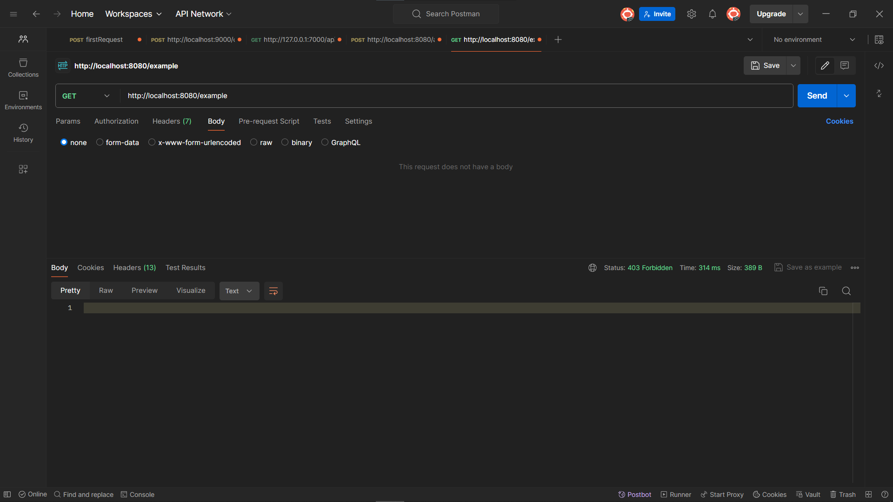
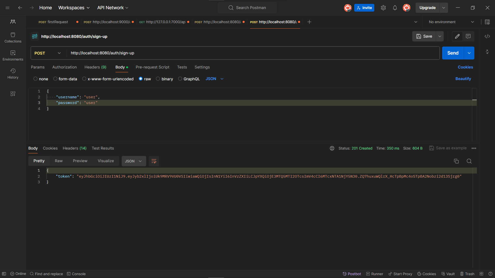
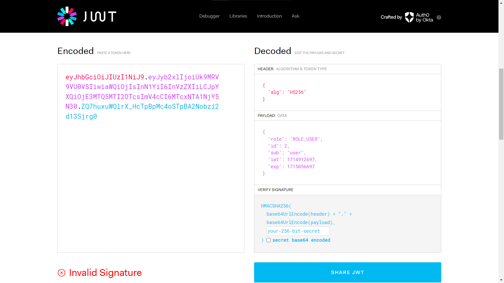
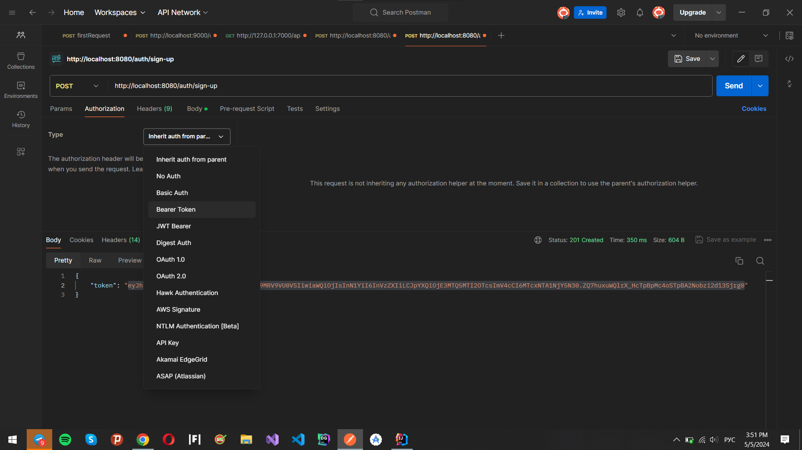
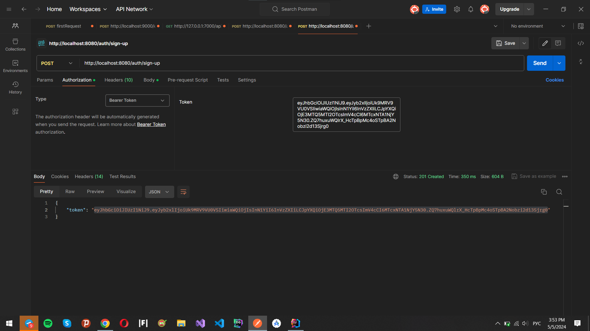
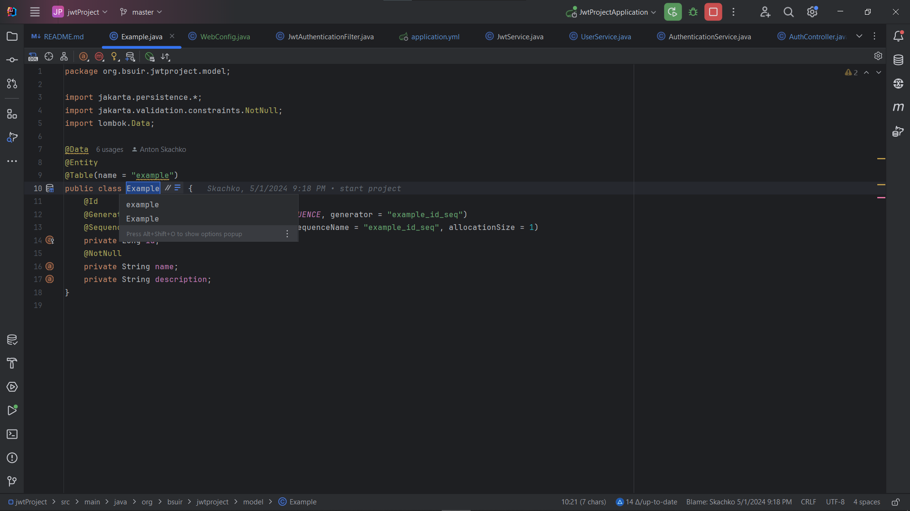
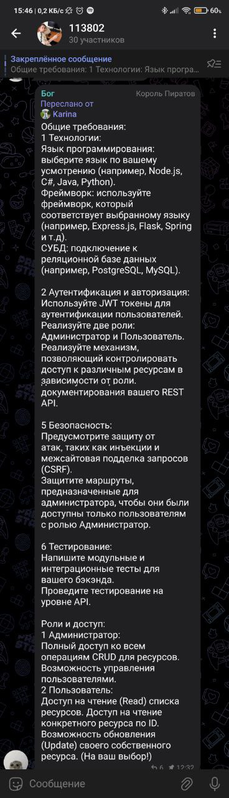

# Все лабы по РВСдМС

### Для начала работы вам нужны след элементы:
1. Postman - это инструмент для разработки API, который позволяет вам легко тестировать и отлаживать ваши API-интерфейсы. Ссылка на скачивание: https://www.postman.com/downloads/
2. Intellij IDE (желательно Ultimate) - нужна для разработки проекта. Cсылка на скачивание: https://www.jetbrains.com/idea/download/?section=windows
3. MySQL Driver - это библиотека, которая позволяет вашему приложению взаимодействовать с базой данных. Ссылка на скачивание: https://dev.mysql.com/downloads/mysql/
4. В самом Intellij нужно скачать драйв mysql под Java. 
5. Java (версия должна быть 17 и выше) - язык на которм будем писать код. 
6. Скачиваете этот проект.

### Начало работы

Для начала нужно создать схему в бд под названием jwt_project. Так же нужно будет заменить username и password в `src/main/resources/application.yml`, на тот который был создан когда мы устанавливали MySql
```yaml
  datasource:
    url: jdbc:mysql://localhost:3306/jwt_project
    driver-class-name: com.mysql.cj.jdbc.Driver
    username: <Тут находиться ваше имя>
    password: <Тут находиться пароль>

```
видео по созданию схемы: 


https://github.com/AntonSkachko/jwtProject/assets/63850442/fc27cbc8-bb65-42c2-9e54-f00deb205e8d


Далее мы протестируем работу нашего проекта:

1. Запустим проект нажав на кнопку Run или сочетание клавиш Shift + F10.


2. Заходим в Postman. И начинаем тестировать наш проект:
   1. Попробуем получать данные по конечной точке `http://localhost:8080/example`
    
   Тут мы видим, что нам доступ запрещён (403 Forbidden). Следовательно, нам нужно войти в приложения.

   2. Для того, что бы авторизоваться, нужно перейти по конечной точке `http://localhost:8080/auth/sign-up` нужно передать соответствующие данные в теле запроса, предварительно выбрав тип тела, в нашем случае JSON.
   
   Тут в body мы указываем Json пользователя, тут должен быть username и password, обе строки.
   
   3. Этот полученный токен мы можем посмотреть содержимое зайдя на сайт `https://jwt.io/`.
   
   
   4. В Authorization нужно поменять type с Inherit auth from на Bearer Token.
   
   
   5. Указываем токен в отктом окне
   
   Теперь мы можем делать запросы к серверу и получать различные данные.
   
   6. Делаем запрос к `http://localhost:8080/example`
   
   Так как в бд у нас ничего нет, поэтому выводит пустой массив.


3. Теперь у нас есть протестированный бек, который работает с example, но нам нужно работать с нужными для нас данными. Для этого нам нужно все классы со словом Example, заменить на нашу сущность с помощью сочетания клавиш Shift + F6.
 и уже тут писать нужным нам класс. Так же нужно нам сделать с ExampleRepository и с ExampleController, и везде где у вас написано слово example и слово пример.


4. Повторить весь 2 путь, только с нашими данными.


5. Далее нам нужно отключить сброс базы данных при каждом шаге, для этого нам нужно закомитить следующую часть кода в `application.yml`. и если вы что меняете в сущностях то возвращаешь.
```yaml
# это нужно будет закомитить на шагу 5
  jpa:
    hibernate:
      ddl-auto: create
    show-sql: true
    properties:
      hibernate:
        format_sql: true
    database-platform: org.hibernate.dialect.MySQLDialect
# -----------------------------------
```

6. Для пользователя обычного пользователя доступно, только просмотр, а под admin ты можешь удалять и добавлять элементы. чтоб зайти через админа, нужно только вместо sign-up нужно написать sign-in и уже зайти как админ. username admin и password admin, а так вход работает точно также как и на 2 пути.


7. чтоб зайти на Swagger (Swagger позволяет автоматически создавать документацию для API на основе спецификации OpenAPI). нужно запустить проект и перейти по ссылке http://localhost:8080/swagger-ui/index.html

### Дополнительная литература:
1. Весь проект был взят и немного переделан из книги Spring security in action
2. Почитать про jwt: https://habr.com/ru/articles/340146/
3. Почитать про spring: https://habr.com/ru/articles/490586/
4. Почитать про работу с бд: https://habr.com/ru/articles/435114/
5. Почитать про работу с Spring rest api: https://habr.com/ru/articles/435144/


все требования от Препода выполнены вот и они:




   
